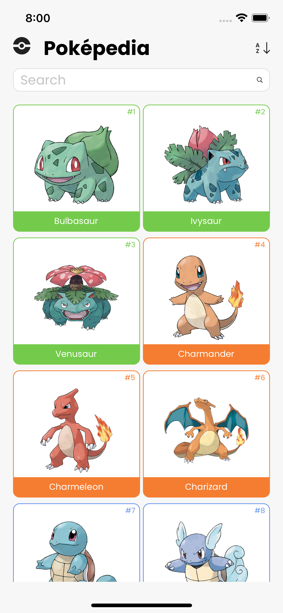
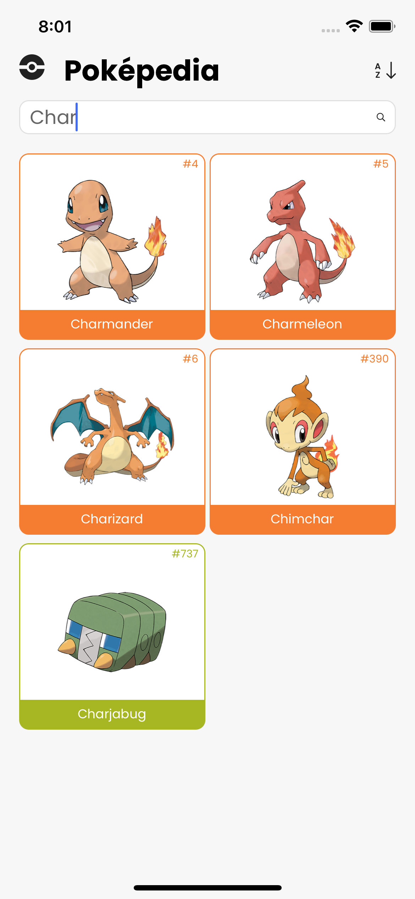
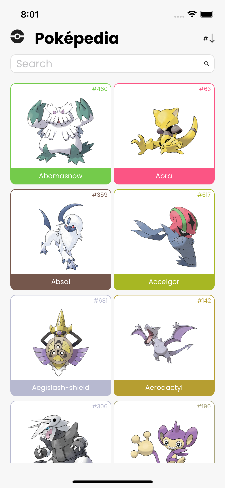
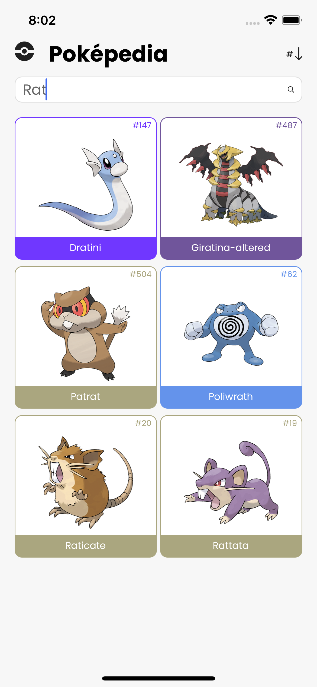
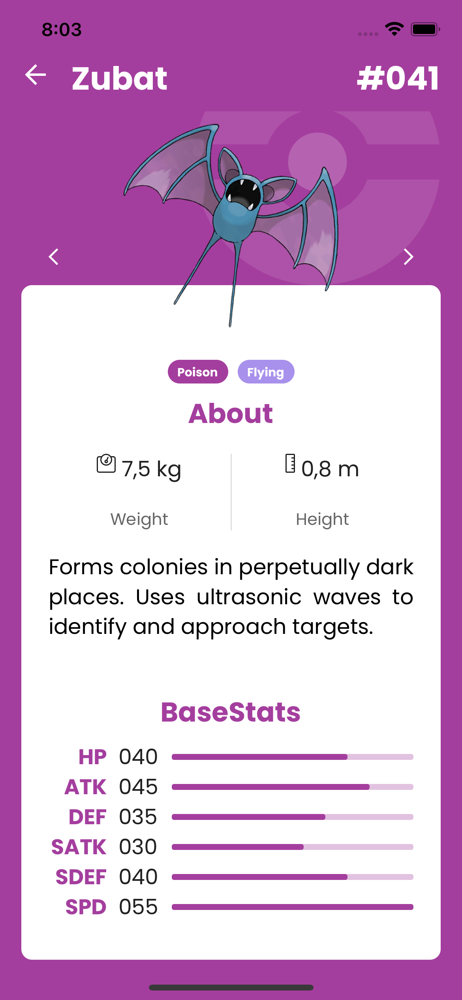

<h1 align="center">
  PokéPedia - The Pokémon Encyclopedia 
</h1>

A simple React-Native Pokédex

<h1 align="center">About</h1>

This application was conceived for study purposes only. It is not licensed nor endorsed by Nintendo/GameFreak/The Pokémon Company. 

### Technologies:
- [React Native 0.66.4](https://reactnative.dev/)
- [TypeScript](https://www.typescriptlang.org/)
- [React Navigation](https://reactnavigation.org/)
- [React Native Image Progress](https://github.com/oblador/react-native-image-progress)
- [React Native SVG](https://axios-http.com)
- [Styled Components](https://axios-http.com)

<h4 align="center"> 
	🚧  In development...  🚧
</h4>

<h1 align="center">Screenshots</h1>

Image 1 (Home Screen) 
Image 2 (Home Screen - search) 
Image 3 (Home Screen - sort by name) 
Image 4 (Home Screen - search and sort by name) 
Image 5 (Pokémon Screen) 

                                 

<h1 align="center">Contributor</h1>

Thanks to Ricardo Schiniegoski for the <a href="https://www.figma.com/community/file/979132880663340794">layout</a>!

<a href="https://github.com/raffojoao">
 
  
 <b>Ricardo Schiniegoski</b></a> <a href="https://github.com/hsricardoo" title="Ricardo Schiniegoski">🚀</a>

 

<h1 align="center">Author</h1>
<a href="https://github.com/raffojoao">
 
  
 <b>João Raffo</b></a> <a href="https://github.com/raffojoao" title="João Raffo">🚀</a> 

 

